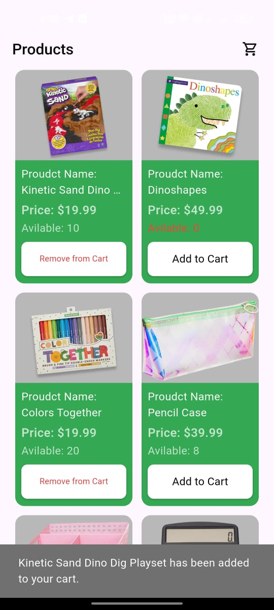
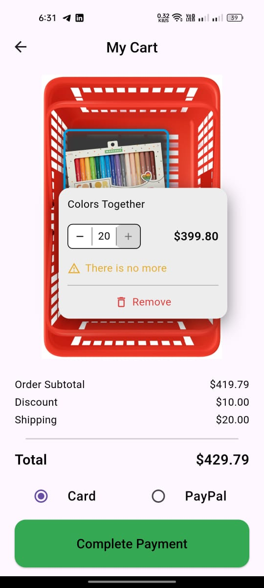
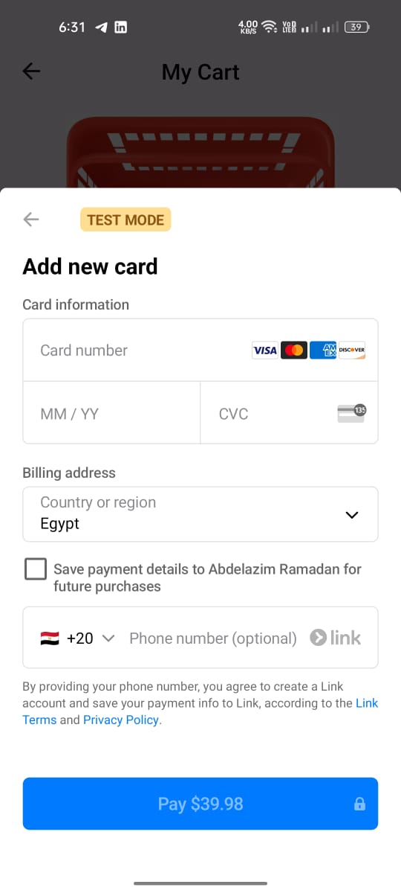
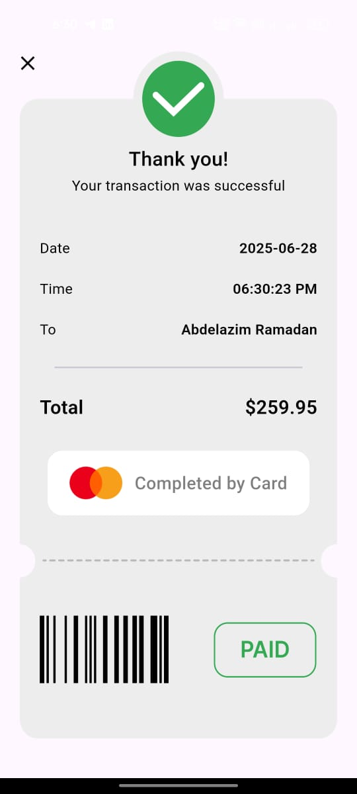

# 🛒 Flutter Payment Checkout Feature
## 📌 Overview

**Flutter Payment Checkout Feature** is a modern, full-featured e-commerce checkout system built using Flutter. It offers seamless integration with **Stripe** and **PayPal**, allowing users to securely complete transactions through popular and reliable payment gateways.

The project demonstrates clean architecture using **Cubit (BLoC)** for state management, **Stripe PaymentSheet** for native card payments, and a smart product basket UI for enhanced user experience.

---

## ✨ Features

- ✅ **Add to Cart**  
  Add multiple products to a dynamic basket view with quantity management.

- ✅ **Stripe Integration (PaymentSheet)**  
  Secure card payments using Stripe's official SDK and PaymentSheet UI.

- ✅ **PayPal Integration**  
  Optional payment via PayPal, with sandbox mode enabled for testing.

- ✅ **Product Tooltip UI**  
  Hover or tap on a product in the basket to view/edit its quantity or remove it.

- ✅ **Dynamic Quantity & Inventory Updates**  
  Real-time update of available product quantities post-transaction.

- ✅ **Transaction Summary Screen**  
  Displays success details (name, total, date, method) after payment completion.

- ✅ **Payment Error Handling**  
  Graceful error views in case of cancellation or payment failure.

- ✅ **Clean State Management**  
  Built with `Cubit` for maintainability and predictable behavior.

---

## 📸 Screenshots
<p align="center">
  
  
</p>
<hr style="border: 0.5px solid #ccc;" />
<p align="center">
  
  
</p>

## 🎬 Demo

> 🔗 check the demo post on [LinkedIn](https://www.linkedin.com/posts/azimramadan_flutter-stripe-paypal-activity-7344755505623396352-AoTP?utm_source=share&utm_medium=member_android&rcm=ACoAAEnUMDsBHOQmpv6_GP-fBGNNSeeDyOxGA6A)

---


## 🚀 Installation

Follow these steps to run the app locally:

```bash
# 1. Clone the repo
git clone https://github.com/yourusername/flutter_payment_checkout.git
cd flutter_payment_checkout

# 2. Install dependencies
flutter pub get

# 3. Add .env file with your Stripe and PayPal credentials
touch .env

# 4. Run the app
flutter run
```

Inside your `.env` file, add the following:

```env
SECRET_kEY=your_stripe_secret_key
CLIENT_ID_PAYPAL=your_paypal_client_id
SECRET_kEY_PAYPAL=your_paypal_secret_key
```

---

## 🧪 How to Use

- **Browse the list of products.**
- **Tap to add to cart.**
- **View your basket** – tap any item to change quantity or remove it.
- **Choose a payment method** (Stripe or PayPal).
- **Tap "Complete Payment".**
- You will be redirected to a **Transaction Success** or **Error** screen.

## 🛠️ Built With

- **Flutter** – Cross-platform UI toolkit  
- **Dart** – Language for Flutter  
- **Cubit (flutter_bloc)** – State management  
- **Stripe SDK** – PaymentSheet for card payments  
- **PayPal SDK** – Payment flow via `flutter_paypal_payment`  
- **Dio** – HTTP client  
- **flutter_dotenv** – Secure environment key management  
- **Intl** – Date and time formatting  

## 📬 Contact & Acknowledgments

Developed with ❤️ by **Abdelazim Ramadan**

📧 Email: [eng.abdelazim3@gmail.com](mailto:eng.abdelazim3@gmail.com)

🔗 Connect with me on:  [LinkedIn](https://www.linkedin.com/in/azimramadan)

---

**Thanks for stopping by. Keep creating! 🛠️**
